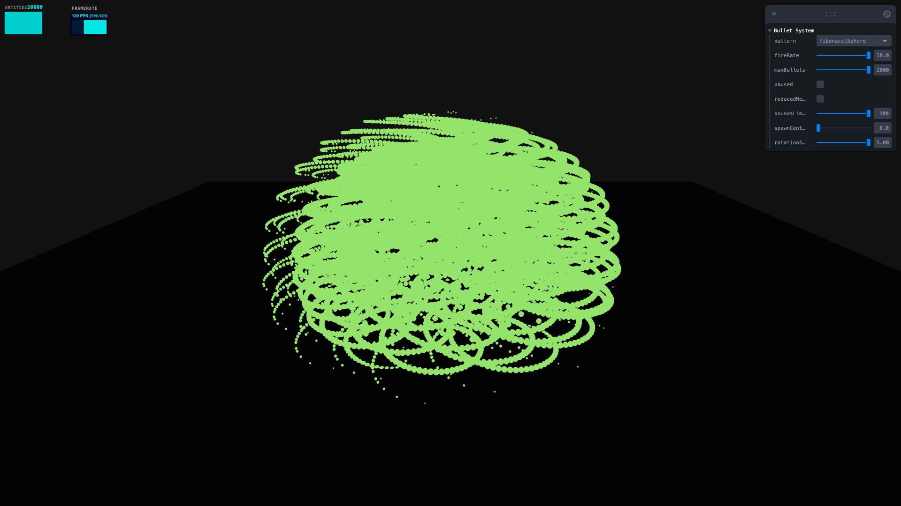

# @k9kbdev/r3f-projectiles

Composable, GPU-instanced projectile system for React Three Fiber. Zero-allocation render loop. 20,000 simultaneous bullets at 120 fps.

[](https://www.npmjs.com/package/@k9kbdev/r3f-projectiles)
[](./LICENSE)
[](https://bundlephobia.com/package/@k9kbdev/r3f-projectiles)

```tsx
import { Canvas } from '@react-three/fiber';
import { BulletManager } from '@k9kbdev/r3f-projectiles';

export default function App() {
  return (
    <Canvas>
      <BulletManager pattern="fibonacciSphere" fireRate={2} />
    </Canvas>
  );
}
```

---

## Features

- **Composable pattern system** — `gen → mod → compose` pipeline for building custom bullet patterns from simple primitives.
- **GPU-instanced rendering** — a single `<instancedMesh>` drives 20,000 bullets at 120 fps.
- **Zero-allocation render loop** — scratch `Object3D`, `Vector3`, and `Color` objects are created once and reused every frame.
- **Object pooling** — `acquire()` / `releaseSpawnData()` recycle `BulletSpawnData` objects to eliminate GC pressure.
- **Accessibility** — `reducedMotion` prop spawns a static snapshot with zero velocity.
- **Tree-shakeable** — import just the pattern math (`@k9kbdev/r3f-projectiles/patterns`) without pulling in React.
- **TypeScript-first** — full type exports for `BulletSpawnData`, `PatternFactory`, `Modifier`, and more.

---

## Installation

```bash
npm install @k9kbdev/r3f-projectiles
```

### Peer dependencies

| Package | Version |
|---|---|
| `react` | `≥ 18` |
| `@react-three/fiber` | `≥ 8` |
| `three` | `≥ 0.150` |

---

## Stress Test Example




To see the performance for yourself, run the built-in stress test:

```bash
npm run dev:stress
```

This launches a Vite dev server at `localhost:5173` featuring a UI to toggle between patterns, crank the fire rate, and spawn up to 20,000 bullets while tracking your browser's framerate, render time, and memory usage in real-time.

---

## Quick Start

```tsx
import { useRef } from 'react';
import { Canvas } from '@react-three/fiber';
import {
  BulletManager,
  gen, mod, compose,
  type BulletManagerHandle,
} from '@k9kbdev/r3f-projectiles';

function Scene() {
  const ref = useRef<BulletManagerHandle>(null);

  return (
    <>
      <BulletManager
        ref={ref}
        pattern={() => compose(gen.ring(80, 3), mod.color(0x39ff14))}
        fireRate={2}
        onBulletCount={(n) => console.log('active:', n)}
      />
      <mesh onClick={() => ref.current?.fire()}>
        <boxGeometry />
        <meshBasicMaterial color="white" />
      </mesh>
    </>
  );
}

export default function App() {
  return (
    <Canvas camera={{ position: [0, 6, 12] }}>
      <Scene />
    </Canvas>
  );
}
```

---

## API Reference

### `<BulletManager>`

A fully props-driven R3F component backed by a single `<instancedMesh>`. Accepts a `ref` for imperative control.

#### Props

| Prop | Type | Default | Description |
|---|---|---|---|
| `maxBullets` | `number` | `2000` | Maximum concurrent bullet instances. |
| `pattern` | `PatternKey \| PatternFactory` | `'fibonacciSphere'` | Built-in pattern name or custom factory function. |
| `fireRate` | `number` | `1.5` | Shots per second. |
| `paused` | `boolean` | `false` | Freeze the simulation (bullets hold position). |
| `reducedMotion` | `boolean` | `false` | Spawn a single static snapshot with zero velocity. |
| `boundsLimit` | `number` | `25` | Distance from origin at which bullets are deactivated. |
| `spawnCenterY` | `number` | `3` | Y-coordinate of the spawn center. |
| `rotationSpeed` | `number` | `0.3` | Radians/second for the source-position orbit. |
| `children` | `ReactNode` | `<meshBasicMaterial fog={false} />` | Custom material override. |
| `onBulletCount` | `(count: number) => void` | — | Called once per frame with the active bullet count. |

#### Built-in `PatternKey` values

| Key | Description |
|---|---|
| `'fibonacciSphere'` | Golden-angle sphere — even omni-directional burst. |
| `'torusKnot'` | Parametric (2,3) torus knot. |
| `'galaxy'` | Logarithmic spiral-arm galaxy. |
| `'helix'` | DNA-style double helix. |
| `'rose3D'` | 3D rhodonea rose curve. |
| `'ring'` | Flat ring expanding outward. |

Human-readable labels for UI dropdowns are available as `PATTERN_LABELS`:

```ts
import { PATTERN_LABELS } from '@k9kbdev/r3f-projectiles';
// { fibonacciSphere: 'Fibonacci Sphere', torusKnot: 'Torus Knot', … }
```

---

### Pattern Generators (`gen.*`)

Each generator returns an array of pool-acquired `BulletSpawnData`. Call `releaseSpawnData()` after consumption.

| Generator | Signature | Description |
|---|---|---|
| `gen.fibonacciSphere` | `(count, radius)` | Golden-angle sphere distribution. |
| `gen.torusKnot` | `(count, p?, q?, radius?)` | Parametric torus knot (`p=2, q=3, radius=2`). |
| `gen.galaxy` | `(count, radius?, arms?, spin?)` | Spiral-arm galaxy (`radius=4, arms=3, spin=2`). |
| `gen.helix` | `(count, radius?, height?, turns?)` | Helix spiral (`radius=2, height=4, turns=2`). |
| `gen.rose3D` | `(count, k?, radius?)` | 3D rose/rhodonea curve (`k=4, radius=2`). |
| `gen.ring` | `(count, speed?, radius?)` | Flat expanding ring (`speed=2, radius=0`). |

---

### Pattern Modifiers (`mod.*`)

Modifiers are curried — call with config to get a `Modifier` function. Modifiers mutate spawn data in-place and return the array.

| Modifier | Signature | Description |
|---|---|---|
| `mod.color` | `(hex: number)` | Set a uniform color on every bullet. |
| `mod.accelerate` | `(forward: number, lateral?: number)` | Apply forward and/or lateral acceleration. |
| `mod.sequence` | `(delayStep: number)` | Stagger spawn times so bullets appear in sequence. |
| `mod.rotate` | `(axis: Vector3, angle: number)` | Rotate all offsets, velocities, and accelerations. |

---

### `compose()`

Pipe a generator result through zero or more modifiers. Modifiers are applied left-to-right and mutate the array in-place.

```ts
import { gen, mod, compose } from '@k9kbdev/r3f-projectiles';

const burst = compose(
  gen.ring(100, 3),
  mod.color(0x39ff14),
  mod.accelerate(1.5),
  mod.sequence(0.02),
);
```

**Signature:**

```ts
function compose(
  generatorResult: BulletSpawnData[],
  ...modifiers: Modifier[]
): BulletSpawnData[];
```

---

### Imperative Handle

Attach a ref to access `fire()`, `clear()`, and `activeCount`:

```tsx
import { useRef } from 'react';
import { BulletManager, type BulletManagerHandle } from '@k9kbdev/r3f-projectiles';

function Scene() {
  const ref = useRef<BulletManagerHandle>(null);

  return (
    <>
      <BulletManager ref={ref} pattern="galaxy" />
      <button onClick={() => ref.current?.fire()}>Fire!</button>
      <button onClick={() => ref.current?.clear()}>Clear</button>
      {/* ref.current?.activeCount — read the live bullet count */}
    </>
  );
}
```

| Member | Type | Description |
|---|---|---|
| `fire()` | `() => void` | Manually trigger one burst of the current pattern. |
| `clear()` | `() => void` | Deactivate all bullets and reset the simulation timer. |
| `activeCount` | `readonly number` | Number of bullets currently alive. |

---

### Custom Material

Override the default `<meshBasicMaterial>` by passing a child:

```tsx
<BulletManager pattern="galaxy">
  <meshStandardMaterial emissive="hotpink" emissiveIntensity={2} />
</BulletManager>
```

---

### Object Pool (`acquire` / `releaseSpawnData`)

Low-level API for custom pattern generators.

```ts
import { acquire, releaseSpawnData } from '@k9kbdev/r3f-projectiles';

// Get a reset BulletSpawnData from the pool (or a fresh allocation)
const bullet = acquire();
bullet.offset.set(1, 0, 0);
bullet.velocity.set(0, 1, 0);

// After consumption, return the array to the pool
const batch = [bullet];
releaseSpawnData(batch);
```

`acquire()` returns objects with zeroed vectors, `delay = 0`, `color = null`, `life = 5.0`. The pool caps at 20 000 objects.

---

## Creating Custom Patterns

### Simple radial burst

```ts
import { gen, mod, compose } from '@k9kbdev/r3f-projectiles';

const redBurst = () => compose(
  gen.ring(64, 4),
  mod.color(0xff0000),
  mod.accelerate(0.5),
);
```

### Sequenced helix with lateral drift

```ts
import { Vector3 } from 'three';
import { gen, mod, compose } from '@k9kbdev/r3f-projectiles';

const driftingHelix = () => compose(
  gen.helix(120, 1.5, 6, 3),
  mod.color(0xff66ff),
  mod.sequence(0.01),
  mod.accelerate(0.3, 1.2),
);
```

### Rotated torus knot

```ts
import { Vector3 } from 'three';
import { gen, mod, compose } from '@k9kbdev/r3f-projectiles';

const tiltedKnot = () => compose(
  gen.torusKnot(250, 3, 5, 2),
  mod.color(0x33ffff),
  mod.rotate(new Vector3(1, 0, 0), Math.PI / 4),
);
```

Use any of these as the `pattern` prop:

```tsx
<BulletManager pattern={driftingHelix} fireRate={1} />
```

---

## Zustand Integration

Wire `BulletManager` to a Zustand store for reactive pattern switching:

```tsx
import { create } from 'zustand';
import { Canvas } from '@react-three/fiber';
import {
  BulletManager,
  gen, mod, compose,
  PATTERN_LABELS,
  type PatternKey,
  type PatternFactory,
} from '@k9kbdev/r3f-projectiles';

interface BulletStore {
  pattern: PatternKey | PatternFactory;
  fireRate: number;
  paused: boolean;
  setPattern: (p: PatternKey | PatternFactory) => void;
  setFireRate: (r: number) => void;
  togglePause: () => void;
}

const useStore = create<BulletStore>((set) => ({
  pattern: 'fibonacciSphere',
  fireRate: 1.5,
  paused: false,
  setPattern: (pattern) => set({ pattern }),
  setFireRate: (fireRate) => set({ fireRate }),
  togglePause: () => set((s) => ({ paused: !s.paused })),
}));

function Scene() {
  const { pattern, fireRate, paused } = useStore();
  return <BulletManager pattern={pattern} fireRate={fireRate} paused={paused} />;
}

export default function App() {
  const { setPattern, togglePause } = useStore();

  return (
    <>
      <div style={{ position: 'absolute', zIndex: 1, padding: 16 }}>
        {(Object.keys(PATTERN_LABELS) as PatternKey[]).map((key) => (
          <button key={key} onClick={() => setPattern(key)}>
            {PATTERN_LABELS[key]}
          </button>
        ))}
        <button onClick={togglePause}>⏯ Pause</button>
      </div>
      <Canvas camera={{ position: [0, 6, 14] }}>
        <Scene />
      </Canvas>
    </>
  );
}
```

---

## Design Decisions

### Zero-allocation render loop

Every frame updates up to `maxBullets` (default: 2,000) bullet transforms. To avoid triggering garbage collection, the `useFrame` callback never allocates. All `Object3D`, `Vector3`, and `Color` scratch objects (`_dummy`, `_tempColor`, `_sourcePos`) are created once in `useMemo` and reused on every frame call. `addScaledVector(v, dt)` updates physics in-place.

### Object pooling (`acquire` / `releaseSpawnData`)

Pattern generators call `acquire()` to get a `BulletSpawnData` — either from the free list or a fresh allocation. After the spawner consumes the data, `releaseSpawnData()` returns the objects to the pool. The pool is capped at 20 000 to bound memory. This avoids per-burst allocation pressure that would otherwise create thousands of short-lived objects.

### GPU buffer optimization

`instanceMatrix.setUsage(DynamicDrawUsage)` hints to the GPU driver that the buffer is written every frame. The `needsUpdate = true` flag is set **once** after the full bullet loop — never per-bullet — to batch the GPU upload.

### Functional composition (`gen` / `mod` / `compose`)

The pattern API is intentionally functional: generators produce data, modifiers transform it, and `compose()` pipes them together. This makes patterns composable without inheritance and enables tree-shaking — import `@k9kbdev/r3f-projectiles/patterns` to use the math without React.

### Accessibility (`reducedMotion`)

When `reducedMotion` is `true`, the component spawns a single static snapshot (capped at 200 bullets) with zero velocity. No animation runs — the `useFrame` callback returns immediately after the one-time spawn. This respects `prefers-reduced-motion` while still showing the pattern shape.

---

## Accessibility

Use the `reducedMotion` prop to respect user preferences:

```tsx
const prefersReduced = window.matchMedia('(prefers-reduced-motion: reduce)').matches;

<BulletManager pattern="galaxy" reducedMotion={prefersReduced} />
```

This spawns a static, non-animated snapshot of the pattern — safe for users sensitive to motion.

---

## Tree-Shaking: Patterns without React

The pattern math is available as a separate entry point that does not import React or R3F:

```ts
import { gen, mod, compose } from '@k9kbdev/r3f-projectiles/patterns';
```

Use this in non-React contexts (e.g. a plain three.js app, a server-side generator, or tests).

---

## Contributing

1. Fork the repo
2. Create a feature branch: `git checkout -b feat/my-pattern`
3. Install: `npm install`
4. Dev: `npm run dev`
5. Test: `npm test`
6. PR against `main`

---

## License

MIT — [Kaleb Kougl](https://github.com/Kaleb-Kougl)
